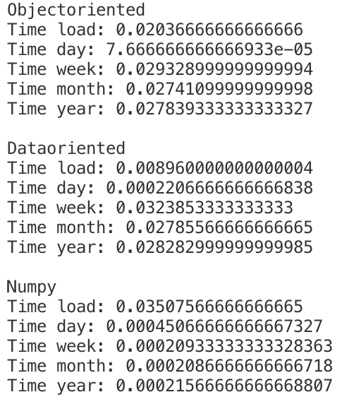

# Dataoriented Programming vs. Objectoriented Programming

## Performance Stats



## Tasks
### Task1 

Provide an object-oriented programming approach by completing the class
template and implementing the methods accordingly. Instructions can be found
in the class' and method's own docstrings.

#### Classes
##### WeatherObservation
```
class WeatherObservation
```

Class containing all temperature and humidity fields as contained in the
CSV files.

The individual values should be accessible as instance variables or
attributes, they must be named exactly as the columns of the CSV files.

All values should be stored as floats. Missing values should be represented
by 'None'.

For simplicity, this class can also be used for aggregation of values
(although the names of the variables/attributes are not really meaningful
anymore then).

You are free to write your own classes for aggregation of values (on a
weekly, monthly, yearly basis) though. This might be beneficial to win the
chocolate challenge (see Task 4 below). If you do so, please implement
them as classes inheriting from this class and use the same attribute /
eariable names.

##### WeatherObservationsObjectOriented
```
class WeatherObservationsObjectOriented
```

A generic class representing all weather observations.

All weather observations must be collected in a dictionary named
`observations`. The key for the individual items are `datetime` instances.
The items are instances of `WeatherObservation`.

This class provides some methods to display the (aggregated) weather
observations for a specific, day, week, month, and year.

As an aggregation function the arithmetic mean should be used.
Missing values should be omitted during aggregation.

###### Methods of WeatherObservationsObjectOriented
###### ```load_data(self,filename)```
This method must load all data from the filename given and populate
the object's variables.

**Parameters**

filename : str
                File containing the weather observations in CSV format.

###### ```day(self, date)```
Display the weather observations for this specific day.
If no observation is available, return 'None'.

**Parameters**
 
date : datetime instance
                Date for which the weather observations should be given.

**Returns**
 
observation : WeatherObservation instance
                Weather observation for that day.

###### ```week(self, date)```
Display the aggregated weather observations for this specific week.
According to the ISO standard, a week is defined to start on Monday.
If no observations are available to be aggregated, return 'None'.

**Parameters**
 
date : datetime instance
                Date for which the different values should be aggregated.

**Returns**

week_average : WeatherObservation instance
                Weather observations aggregated by week.

###### ```month(self, date)```
Display the aggregated weather observations for this specific month.
If no observations are available to be aggregated, return 'None'.

**Parameters**

date : datetime instance
                Date for which the different values should be aggregated.

**Returns**

month_average : WeatherObservation instance
                Weather observations aggregated by month.

###### ```year(self, date)```
Display the aggregated weather observations for this specific year.
If no observations are available to be aggregated, return 'None'.

**Parameters**

date : datetime instance
                Date for which the different values should be aggregated.

**Returns**

year_average : WeatherObservation instance
                Weather observations aggregated by year.

### Task2
Provide an data-oriented programming approach and complete the class template
and implement the methods accordingly. Only Python's own mechanisms
(i.e. lists, dictionaries, tuples) should be used. Numpy is not allowed.

Please consider the exemplary access patterns of Task 4 when designing your
data-oriented approach.

#### Classes
##### WeatherObservation
```
class WeatherObservation
```

Class containing all temperature and humidity fields as contained in the
CSV files.

The individual values should be accessible as instance variables or
attributes, they must be named exactly as the columns of the CSV files.

All values should be stored as floats. Missing values should be represented
by 'None'.

For simplicity, this class can also be used for aggregation of values
(although the names of the variables/attributes are not really meaningful
anymore then).

You are free to write your own classes for aggregation of values (on a
weekly, monthly, yearly basis) though. This might be beneficial to win the
chocolate challenge (see Task 4 below). If you do so, please implement
them as classes inheriting from this class and use the same attribute /
eariable names.


##### WeatherObservationsDataOriented
```
class WeatherObservationsDataOriented
```

A generic class representing all weather observations.

All weather observations should be stored in a data-oriented fashion. It is up to you on how the data is organised. Only Python's own mechanisms
(i.e. lists, dictionaries, tuples) should be used. Numpy is not allowed.

All methods of `WeatherObservationsObjectOriented` class must be
implemented with the same calling signature as for the object oriented
example above. They should also return `WeatherObservation` instances.

As before, as an aggregation function the arithmetic mean should be used.
Missing values should be handled as 'None' and omitted during aggregation.

I'm working wiht an array wich represents a matrix with nxn every row represents a dataentry
    ```
    [
        [DATE,TEM_DAILYMIN,...],
        [DATE,TEM_DAILYMIN,...]
    ]```

###### Methods of WeatherObservationsObjectOriented
###### ```load_data(self,filename)```
This method must load all data from the filename given and populate
the object's variables.

**Parameters**

filename : str
                File containing the weather observations in CSV format.

###### ```calcMeanFromSet(self,aggregateRows)```
This method receives an array with a the matching Datasets and calculates the mean of every row. For the everage the *None* values are not used.

###### ```day(self, date)```
Display the weather observations for this specific day.
If no observation is available, return 'None'.

**Parameters**

date : datetime instance
                Date for which the weather observations should be given.

**Returns**

observation : WeatherObservation instance
                Weather observation for that day.

###### ```week(self, date)```
Display the aggregated weather observations for this specific week.
According to the ISO standard, a week is defined to start on Monday.
If no observations are available to be aggregated, return 'None'.

**Parameters**

date : datetime instance
                Date for which the different values should be aggregated.

**Returns**

week_average : WeatherObservation instance
                Weather observations aggregated by week.

###### ```month(self, date)```
Display the aggregated weather observations for this specific month.
If no observations are available to be aggregated, return 'None'.

**Parameters**

date : datetime instance
                Date for which the different values should be aggregated.

**Returns**

month_average : WeatherObservation instance
                Weather observations aggregated by month.

###### ```year(self, date)```
Display the aggregated weather observations for this specific year.
If no observations are available to be aggregated, return 'None'.

**Parameters**

date : datetime instance
                Date for which the different values should be aggregated.

**Returns**

year_average : WeatherObservation instance
                Weather observations aggregated by year.

### Task3
Provide an data-oriented programming approach and complete the class template
and implement the methods accordingly. This time in addition to Python's own
mechanisms, Numpy is explicitly allowed and should be used.

As in Task 2, consider the exemplary access patterns of Task 4 when designing
your approach.

#### Classes
##### WeatherObservationsDataOrientedNumpy
```
class WeatherObservationsDataOrientedNumpy
```

A generic class representing all weather observations.

All weather observations should be collected in a data-oriented fashion
and numpy should be used to store the data.

All methods of `WeatherObservationsObjectOriented` class must be
implemented and must have the same calling signature as for the object
oriented example above, but should return numpy arrays instead.

The columns of the returned numpy arrays should have the same ordering
as in the CSV files and contain only the weather observations.

As an aggregation function the arithmetic mean should be used.
Missing values should be handled as NaN (not a number; np.nan) and omitted
during aggregation.

### Task4
Compare the runtime of the different implementations.
Use the timeit module or other appropriate methods.
Average the runtime of 3 runs with 3 different dates.

Record the timing for every step separately and compare them afterwards.

Steps to be performed for each implementation method (Task 1 - 3):

1. load all data from the CSV files into the respective object
2. for a specific date, return all weather observations for that day
3. aggregate all temperature values for the week this day belongs to
4. aggregate all humidity values for the month this day belongs to
5. aggregate the 'temp_dailyMean' values for the year this day belongs to

After performing these 5 steps, you should have 5 timings for each
implementation method. Compare them and put your written evaluation into the
return statement of the `solution_task_4()` function. The answer should not
exceed 250 words.

Please use the provided function templates. You are free to time the steps
given above in any way you think is appropriate.

There will be a chocolate challenge for this exercise. The fastest solution for
each implementation method (Task 1 - 3) wins some chocolate. To qualify for the
challenge, not all implementations must be provided, but correct values must
be computed of course. The access patterns to the data are similar to the 5
steps outlined above.

#### Methods for Task4 
###### ```load_all_data(observations)```
Load all data files for the given observation object.

**Parameters**

observations : WeatherObservations*** instance.
                Initialised WeatherObservations*** object.

**Returns**

observations :
                Same observations object with all data loaded.

###### ```time_steps(observations, date)```
Example function to time the individual steps.

In order to actually time these steps, functionality needs to be
implemented.

**Parameters**

observations : WeatherObservations*** instance.
                Initialised WeatherObservations*** object.
date : datetime instance
                Date for which the different values should be aggregated.

**Returns**

timings : tuple
                Times required to load data, report values for day, week, month and
                year, respectively.

**Notes**

This function will not be used for grading. The timing will be determined
externally.

###### ```evaluate()```
Example function to compare the individual implementations.


### Task5 
Describe in your own words how the implementations of Task 2 and 3 could have
been improved further and what is needed (or missing) in order to do so.
If you implemented them already in an improved fashion, please specify in your
answer how you did so. Your answer should not exceed 250 words.
